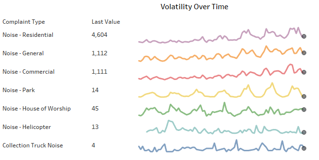

# Demo for creating a Tableau Dashboard.

So the Covid-19 pandemic gave me a chance to learn the visualization software Tableau for free **(yes,you heard it right!!)**. The course itself was provided by Tableau, so there is no dobut about the quality of the material they provied. Here is the link for anyone interested to learn anyways [link](https://www.tableau.com/learn/training/elearning).

Here is a simple demonstration of my learnings from the software to create a Dashboard to show the results of my analysis.

The data-source is directly connected to the workbook.

let us see how to make the following chart.

Note : There are some created parameters, measures and dimensions which I have not expained in detail. Please look at the attached file [here](./workbook/Swap-Sheets-and-Work-with-Dashboard-Layout_Starter_10.4.twbx). I also assume that you have familarity with Tableau and know basics of making different graphs and visualizations.

Let's get started with our visualizations. Here I will show in breif how I created a certain type of chart.

## 1. Noise Complaints chart
- Build a simple line chart of Sum of number of records by complaint type against Created date column.
- Add last value to rows along with last point. (Last point and number of records should share axis)
- The result should look something like this.

## 2. Ranking chart
- Build a chart by dragging created year to columns and sum of number of records to rows
- Year and sum of records should be discrete and calculate rank using quick table calculations. Right click on sum of records and in compute using use complaint type to calculate ranks for each year for different complaint types.
- Add complaint type for marks by colour and Min of sum of records for size. Make sure that bar is selected.
- The result should look something like this

## 3. Slope chart 
- Change created date by year to discrete and  apply same to filter section selecting 2011 and 2016 as the years.
- Add number of records to rows and use rank for quick calculation by complaint type.
- Add labels to the mark option and select label and use line end option in label to display names on both sides.
-  The result shold look somethingg like this

## 4. Bump Chart
- It is quite similar to Slope chart only difference is that it is applide to year as a continous column.
- Press ctrl and sum of records in column and drag it side by side. 
- Right click on header and convert to dual axis and synchronise it.
- Use marker type circle for one and output should be like this.

## 5. Control Chart
- Add created date by year and convert it to discrete and also add months in the columns. Add Number of records to rows
- Filter out the years not required and also add complaint type to filter
- Click on Analytics pane and add a reference line at for average of each pane
- Add the custom made functions Lower limit and upper limit to the marks and go back to analytics pane to and add Reference band at lower limit and upper limit
- Add again Number of records to the rows and add synchronize it to previous axis. Add another custom made measure Control limit to find outliers.
- The Final result should look like this.

## 6. Custom Chart selector
- First create a parameter for data type string and add the values in form of list.
here

- Create a Dimension "select a chart" to override this parameter and add [parameter name] to calculation.
here

- In Parameters allow parameter control so that the filter control can be seen.

- Select the chart type and go to the workbook and add select a chart to filter and select the respective chart name for filter and follow the same for other charts and then you have a custom filter for showing different charts.

## 7. The Final Dashboard.
Add the charts and filters to dashboard and your final dashboard should be something like this.

### This was a simple demo of creating a dashboard for your Analysis. I have attached the twbx file here. Have a look for more information on calculations of custom dimensions and measures.

